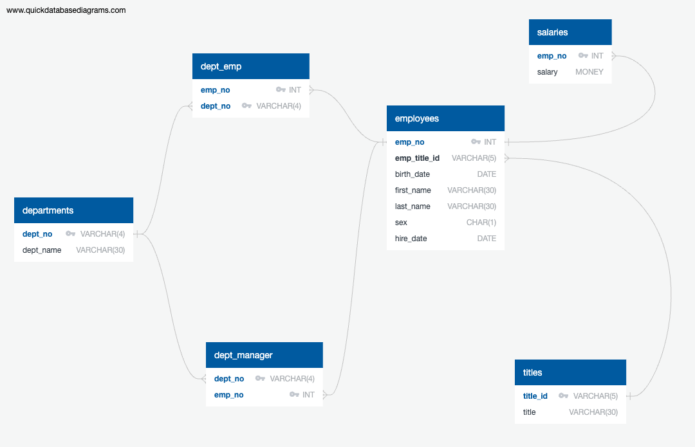

# SQL-Challenge

This assignement is for a fictional company Pewlett Hackard, to do a research project about people whom the company employed during the 1980s and 1990s. For this project, I have designed the tables to hold the data from the CSV files, import the CSV files into a SQL database, and then answer questions about the data. 

The EmployeeSQL folder contains two SQL files (table_schemata.sql and queries.sql):

* The `table_schemata.sql` file builds a relational database which contains tables that hold employees related data from imported csv files. Relationships are defined between tables and columns using primary keys, composite keys and foreign keys. Data was imported in the same order as the corresponding tables got created. This file has the exact order of the table creation.

* The `queries.sql` file quries the desired employee information for Data Analysis purpose.

## Entity Relationship Diagram

The EmployeeSQL_ERD.png visually displays the structure of the tables and relationships between logically related tables of the database (This ERD was sketched using QuickDBD).

